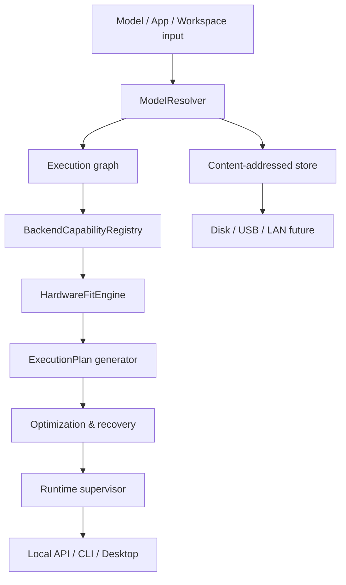

# Архитектура TurkmenAI Local

TurkmenAI Local строится как **одно локальное ядро с несколькими клиентами**, а не как набор независимых приложений. Десктопный интерфейс, CLI, локальная панель и OpenAI-совместимый API обращаются к одному `turkmenai-core`; UI получает готовые capabilities, планы и объяснения, но не принимает model/runtime-решения самостоятельно.

## Неподвижные границы

| Граница | Ответственность | Не делает |
|---|---|---|
| `ModelResolver` | Парсит источник, файлы, метаданные, зависимости и риск custom-code | Не запускает произвольные скрипты |
| `BackendCapabilityRegistry` | Описывает backend версии, формат, hardware и feature surface | Не обещает возможность без triple-match |
| `HardwareFitEngine` | Формирует локальный профиль, вычисляет memory budget и ограничения | Не отправляет телеметрию |
| `ExecutionPlanner` | Генерирует primary и ranked fallback plans | Не изменяет модели или runtime без действия пользователя |
| `Store` | Хранит immutable blobs по SHA-256 и versioned manifests | Не хранит model weights в SQLite |
| `DownloadEngine` | Ведёт journal, `.part`, resume и SHA-256 verification | Не помечает скачивание READY |
| `RuntimeSupervisor` | Запускает/проверяет/останавливает изолированные backend процессы | Не исполняет repository custom code |
| `Local API` | Нормализует `/api/v1` и `/v1` контракты | Не открывает LAN без opt-in |

## Capability negotiation

Фактическая возможность имеет форму пересечения: `ModelCapability ∩ BackendCapability ∩ HardwareCapability ∩ RuntimeVersion`. Если пересечение пусто, Core формирует объяснение, а не абстрактный статус «Unsupported».

Каждый `ExecutionPlan` содержит `primary`, `fallbacks`, `score_breakdown`, `requirements`, ожидаемый режим и уровень доказательности. Оценённые значения явно имеют `evidence: estimated`, измеренные — `evidence: measured`.

## Данные и устойчивость

Манифесты версионируются и ссылаются на immutable blobs. Все критические переходы задач имеют journal и состояние `prepare → download → verify → install → configure → smoke-test → commit`; только `commit` создаёт статус `ready`. Модель и runtime не перезаписываются во время обновления: новый artifact проверяется до атомарной смены ссылки, а предыдущая рабочая ссылка остаётся вариантом отката.

## Безопасность

Любые Hugging Face metadata, direct URLs, архивы и model cards являются недоверенными данными. Resolver классифицирует модель как `weights_only`, `custom_code`, `executable_application` или `unknown`. `custom_code` не исполняется автоматически; ядро возвращает explicit permission requirement и изолированный runtime workspace. LAN sharing, remote inference, MCP tools и file/network/shell permissions выключены по умолчанию.
